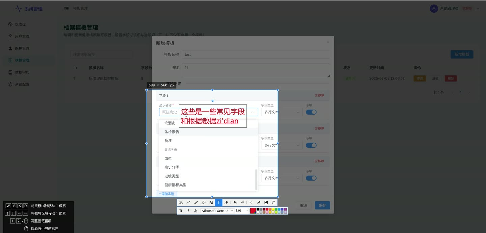
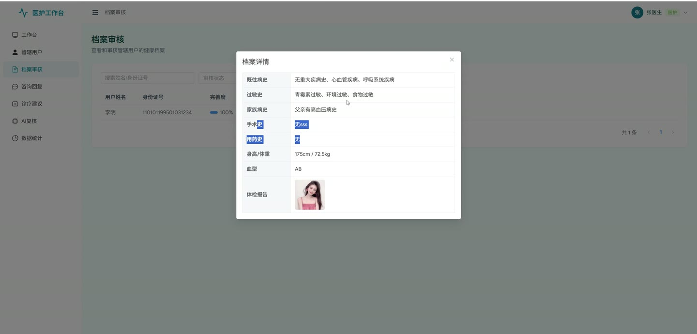
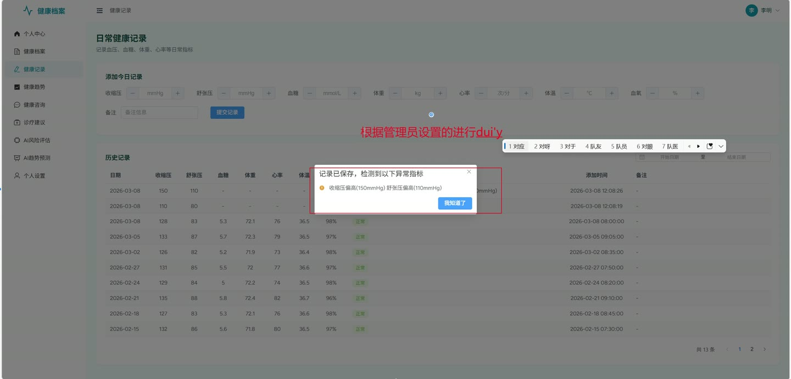
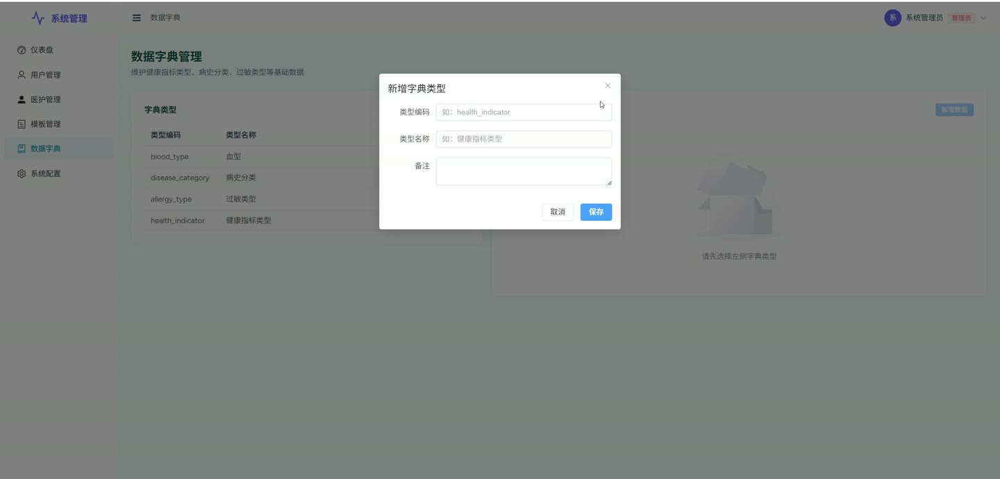
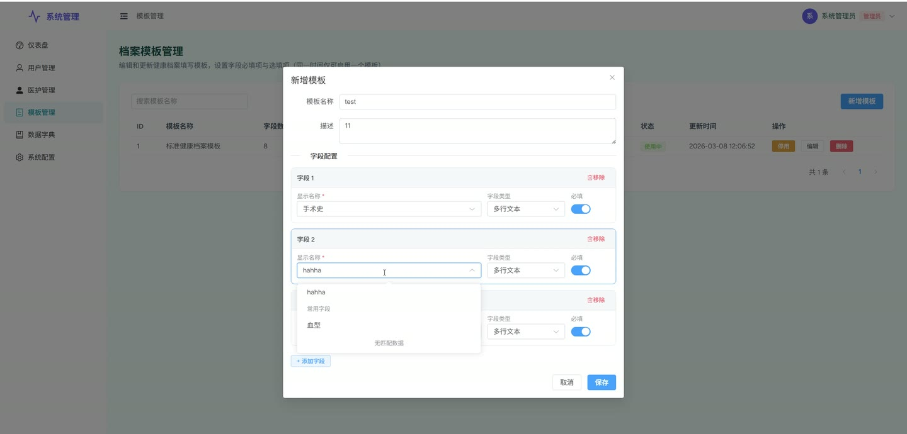

# (附文档)Springboot3+Vue3 健康档案管理系统

**技术栈**：Springboot3、Vue3

### 系统简介

健康档案管理系统是一套面向居民健康管理、医护人员诊疗辅助及平台运营管理的全栈信息化解决方案。系统采用前后端分离架构，围绕居民用户、医护人员、系统管理员三个核心角色，提供从健康档案录入、日常指标监测、AI 风险评估与趋势预测，到在线健康咨询、诊疗建议发布、数据统计与导出的一站式健康管理闭环。
 
### 核心功能
 
### 居民用户端

 
- 注册/登录：支持手机号注册、账号密码登录及密码找回。 
- 个人信息管理：查看/编辑姓名、身份证、手机、头像、性别、生日、紧急联系人及电话。 
- 修改密码：输入旧密码与新密码完成密码修改。 
- 绑定医护人员：从审核通过的医护列表中选择并绑定专属医护。 
- 健康档案管理：按系统模板填写身高、体重、家族病史等字段，提交后等待医护审核。 
- 申请档案修改：对已审核档案发起修改申请，重新提交后进入审核流程。 
- 日常健康记录：录入血压（收缩压/舒张压）、血糖、心率、体温、血氧等指标，系统自动检测异常并提示。 
- 健康趋势图表：按指标类型（血压/血糖等）和时间范围（近7/30天）查看趋势数据。 
- AI 健康风险评估：选择高血压或糖尿病类型，基于决策树算法生成风险评分、风险等级及详细评估说明。 
- AI 健康趋势预测：选择血压或血糖类型及预测月数（1-3个月），基于线性回归算法生成未来指标预测点及趋势描述。 
- 评估/预测历史：分页查看个人所有 AI 评估报告与预测报告。 
- 发起健康咨询：选择医生并填写咨询内容，提交后等待医生回复。 
- 查看我的咨询：分页查看咨询记录及医生回复。 
- 查看诊疗建议：分页查看绑定医生发布的诊疗建议。 
- 字典数据查询：根据类型编码获取下拉选项数据（如性别、科室等）。 
- 个人中心概览：查看档案完善度、健康记录数、近期异常数、咨询数、评估数及最新评估结果。
 
### 医护人员端

 
- 医护信息管理：查看/编辑科室、职称、专长等个人信息。 
- 管辖用户管理：按姓名/手机号搜索管辖用户列表，查看用户详情（含档案与近10条健康记录）。 
- 健康档案审核：分页查看管辖用户档案列表，支持按关键字/审核状态筛选，通过/驳回档案并填写审核备注。 
- 档案导出：将管辖用户档案列表导出为 Excel 文件。 
- 异常指标用户名单：查看最近7天内出现异常指标的管辖用户列表。 
- 医生统计看板：按月统计管辖用户数、记录用户数、异常用户数、各指标异常人数及占比、异常类型分布、科室用户分布，并支持导出为多 Sheet Excel。 
- 健康咨询管理：分页查看待回复/已回复咨询列表，查看用户姓名与手机号，填写回复内容。 
- 发布诊疗建议：选择管辖用户、填写建议标题与内容，发布后用户端可查看。 
- 已发布建议管理：分页查看自己发布的所有诊疗建议。 
- AI 评估复核：查看管辖用户的 AI 评估报告，填写复核备注。 
- 管辖用户 AI 评估/预测列表：分页查看管辖用户的所有 AI 评估与预测记录。 
- 调整 AI 预测参数：对管辖用户的预测记录调整算法参数。 
- 医护首页概览：查看管辖用户数、待审核档案数、待回复咨询数、近期异常记录数。
 
### 系统管理员端

 
- 用户管理：分页查询用户列表，支持按关键字/状态筛选；新增/修改用户信息；冻结/解冻用户账号；重置用户密码为 123456；删除用户。 
- 分配医护人员：为用户绑定指定的审核通过医护人员。 
- 医护人员管理：分页查询医护列表，支持按关键字/审核状态筛选；审核医护资质（通过/驳回），通过后自动激活用户角色，驳回后冻结用户账号。 
- 获取可绑定医护列表：查询所有审核通过的医护人员供管理员分配。 
- 档案模板管理：分页查询模板；新增/编辑模板内容（支持启用/停用，同一时间仅一个模板启用）；删除模板。 
- 数据字典管理：管理字典类型（类型编码唯一，编辑时自动校验冲突）与字典数据（排序、标签、值）；支持按类型编码查询字典数据。 
- 系统配置管理：按分组查询配置列表；新增/编辑配置键值对（配置键唯一，重复时自动覆盖）。 
- 管理员仪表盘：查看用户总数、医护总数、档案总数、档案完善率、活跃用户数、AI 评估/预测总数、评估异常率、月度用户增长趋势图、风险等级分布图。
 
### 通用功能

 
- 文件上传/删除：支持上传文件并返回访问 URL，支持按 URL 删除文件。 
- Swagger 接口文档：所有接口均标注了 Swagger 注解，可通过 Swagger UI 在线调试。
 
### 技术栈

 后端框架Spring Boot 3.x ORMMyBatis-Plus 3.x 权限框架Spring Security + 注解 @PreAuthorize 接口文档SpringDoc OpenAPI (Swagger) AI 算法Apache Commons Math (SimpleRegression 线性回归) Excel 导出EasyExcel JSON 处理Hutool JSONUtil 前端框架Vue 3.x 状态管理Pinia 构建工具Vite 数据库MySQL 8.x
 
### 交付内容

 
- 后端完整源码 
- 前端完整源码 
- 数据库初始化脚本 
- 万字文档

## 界面展示

---

## 获取完整源码 + 万字文档

本仓库为项目介绍页。**完整前后端源码、数据库初始化脚本、万字项目文档**，请访问 [codekk.top](http://codekk.top) 获取。

可作课程设计 / 毕业设计参考，支持远程部署调试。